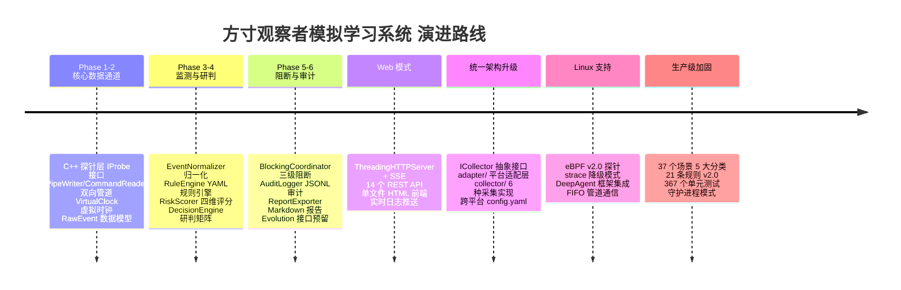
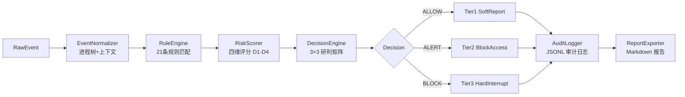
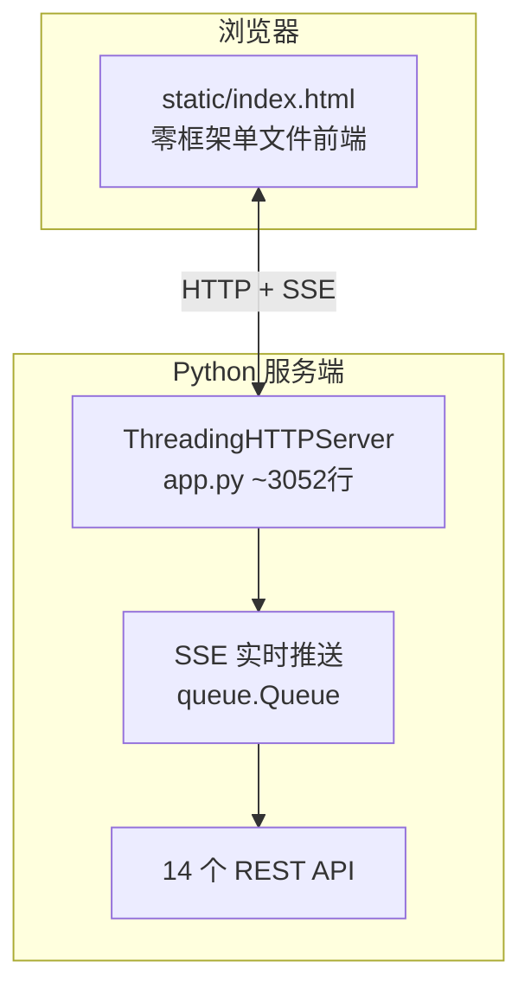
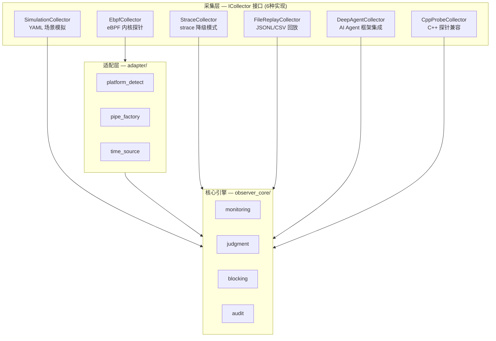
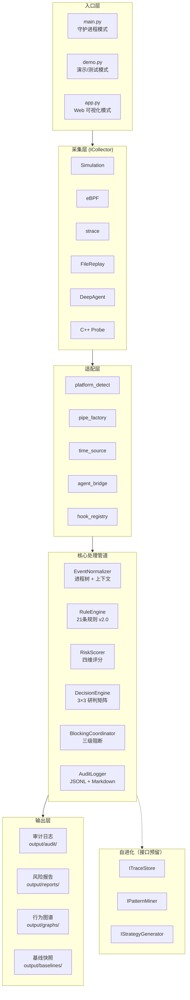
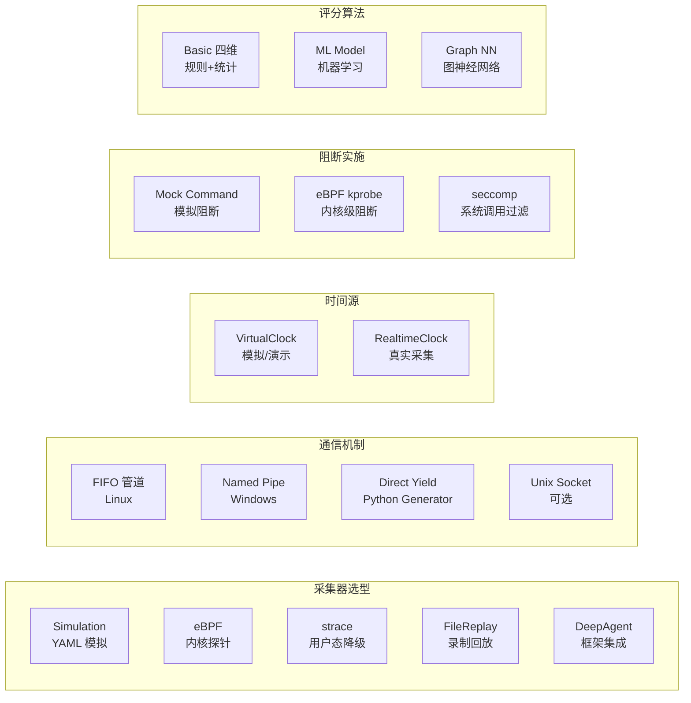

# 开发历程演进路线

> **项目名称**：方寸观察者模拟学习系统（Observer Sim）
> **对标产品**：Fangcun Observer — OS 层 Agent 运行时安全基础设施
> **文档日期**：2026 年 7 月 30 日

---

## 一、项目演进总览



---

## 二、发展阶段详解

### 阶段一：原型验证（Phase 1-2）✅

**目标**：验证"OS 层探针 → 管道 → Python 引擎"的技术可行性。

```
┌──────────────┐     Named Pipe      ┌──────────────────┐
│  C++ 探针层   │ ──── RawEvent ────▶ │  Python 引擎层    │
│  IProbe × 3   │ ◀─── Command ────── │  PipeReader       │
│  PipeWriter   │     (反向管道)       │  CommandSender    │
└──────────────┘                     └──────────────────┘
```

**关键产物**：
- `cpp_probe/`：IProbe 接口 + ProcessProbe/FileProbe/NetworkProbe + RingBuffer
- `models/event.py`：RawEvent / NormalizedEvent / AgentContext
- `models/virtual_clock.py`：VirtualClock 纳秒精度虚拟时钟
- 双向管道通信链路验证通过

**技术决策**：
- 采用 JSON 行协议（C++ → Python 管道），兼容性优于二进制协议
- VirtualClock 统一时间源，驱动全系统时间判定
- C++ 侧使用 RingBuffer 应对管道写入阻塞

---

### 阶段二：核心 Pipeline（Phase 3-6）✅

**目标**：实现完整的"监测 → 评分 → 研判 → 阻断 → 审计"处理链路。



**关键产物**：
- `observer_core/monitoring/`：EventNormalizer + RuleEngine（21 条规则 v2.0）
- `observer_core/judgment/`：四维 RiskScorer + DecisionEngine + BaselineChecker + ChainReportBuilder
- `observer_core/blocking/`：三级 BlockingCoordinator + AgentViolationTracker
- `observer_core/audit/`：AuditLogger（JSONL）+ ReportExporter（Markdown）+ BehaviorGraph

**技术决策**：
- 四维评分权重：D1 规则命中 40%、D2 基线偏离 25%、D3 上下文风险 20%、D4 序列异常 15%
- 3×3 研判矩阵（风险等级 × 规则动作 → 处置决策）
- 三级阻断：Tier1 软报告 → Tier2 阻止访问（EPERM）→ Tier3 硬中断（进程终止）
- 违规升级：Tier1×5→Tier2, Tier2×3→Tier3（虚拟时钟 5 分钟滑动窗口）
- 审计存储简化为 JSON-only（放弃 SQLite）
- D4 序列异常降级为频率偏差模型（放弃马尔可夫链）

---

### 阶段三：Web 可视化 ✅

**目标**：从 CLI 演示升级为 Web 浏览器可视化平台。



**关键产物**：
- `app.py`（~3052 行）：ThreadingHTTPServer + SSE 实时日志推送
- `static/index.html`：深色终端主题单文件前端
- `analysis_panels.py`：四维分析面板（CLI/Web 共享数据源）
- 14 个 REST/SSE API 端点
- 历史报告树形浏览（分类→场景→时间戳）

---

### 阶段四：统一架构升级（Phase 7-10）✅

**目标**：从"Windows 单机 + C++ 探针"升级为"Windows + Linux 双平台 + 6 种采集模式"的插件式架构。



**关键产物**：
- `collector/`：ICollector 接口 + 6 种采集实现
- `adapter/`：platform_detect + pipe_factory + time_source + agent_bridge + hook_registry
- `ebpf/observer.bpf.c`（v2.0）：3 tracepoint（观测）+ 3 kprobe（阻断）
- `config.yaml`：统一配置（mode 切换 + 各采集器参数）
- 三入口改造：main.py / demo.py / app.py → 统一采集模式

**技术决策**：
- ICollector 接口通过 Python `yield` 直接产出事件，不再强制通过管道
- 模拟模式使用 VirtualClock，eBPF/strace 使用 RealtimeClock
- eBPF v2.0 实现了真实 kprobe + bpf_override_return 阻断（不再仅为模拟）
- DeepAgent 集成通过 AgentBridge + HookRegistry 实现框架适配

---

### 阶段五：Linux 平台支持 ✅

**关键能力**：
- eBPF 内核探针采集（3 tracepoint 观测 + 3 kprobe 阻断）
- strace 用户态降级采集（无需 root 权限）
- FIFO 命名管道（LinuxFifoAdapter 替代 Windows Named Pipe）
- DeepAgent 框架集成（Pydantic-DeepAgents）
- 文件录制与回放（EventRecorder + FileReplayCollector）

---

### 阶段六：生产级加固 ✅

**关键能力**：
- 37 个测试场景（Normal 8 / Anomalous 12 / Boundary 8 / Multi-Agent 5 / Extreme 4）
- 21 条安全规则 v2.0（命令 9 + 文件 7 + 网络 5）
- 367 个单元测试全部通过
- MonitorDaemon 守护进程模式（692 行）+ MonitorLifecycleManager（697 行）
- 运行时可调参数（tuning.yaml 热加载）

---

## 三、系统架构全景图（当前状态）



---

## 四、可拓展/可演进的模块

| 模块 | 扩展点 | 当前状态 | 扩展方向 |
|------|--------|:---:|------|
| **ICollector 接口** | `collector/` 目录 | ✅ 6 种实现 | 新增容器探测、WASM 沙箱、K8s audit 等采集器 |
| **IRiskDimension 接口** | `risk_scorer.py` | ✅ 4 个基础维度 | 替换为 ML 模型、马尔可夫链、图神经网络评分 |
| **ITraceStore** | `evolution/interfaces.py` | 🟡 接口桩 | 接入 SQLite/PostgreSQL/向量数据库 |
| **IPatternMiner** | `evolution/interfaces.py` | 🟡 接口桩 | 实现 Apriori/PrefixSpan/序列模式挖掘 |
| **IStrategyGenerator** | `evolution/interfaces.py` | 🟡 接口桩 | 实现基于 LLM 或统计的规则自动生成 |
| **adapter/ 平台层** | `adapter/` 目录 | ✅ 3 个适配器 | macOS 平台支持、容器内运行适配 |
| **HookRegistry** | `adapter/hook_registry.py` | ✅ 已实现 | 注册更多 Agent 框架（CrewAI、MetaGPT） |
| **Web 前端** | `static/index.html` | ✅ 单文件 | 拆分为现代框架（React/Vue）、增加可视化图表 |
| **行为图谱** | `behavior_graph.py` | ✅ JSON 输出 | 接入 Neo4j/Graphviz 实现图可视化渲染 |
| **规则引擎** | `rule_engine.py` | ✅ 4 种匹配 | 支持 YARA/Sigma 规则格式、正则预编译优化 |

---

## 五、可替换的技术路线方案



| 技术点 | 当前主路线 | 可选替代方案 | 切换方式 |
|--------|----------|------------|---------|
| 采集器 | SimulationCollector（演示）<br/>EbpfCollector（生产） | strace/FileReplay/DeepAgent | `config.yaml` 中修改 `mode` |
| 通信 | Direct Yield（模拟）<br/>FIFO（守护进程） | Named Pipe / Unix Socket | `adapter/pipe_factory.py` 平台自动选择 |
| 时间源 | VirtualClock（模拟）<br/>RealtimeClock（生产） | — | 采集模式自动决定 |
| 阻断 | Mock CommandSender（模拟）<br/>EbpfCommandSender（生产） | seccomp BPF | `blocking/` 中切换 sender 实现 |
| 评分 | BasicRuleScore 等（4 维） | 自定义 IRiskDimension 实现 | `RiskScorer.register_dimension()` 注册 |
| 规则格式 | YAML（自定 schema） | YARA / Sigma | 新增 RuleLoader 适配器 |
| 前端 | 单文件 HTML + SSE | React + WebSocket | 替换 `static/` 和 `app.py` |

---

## 六、未完成但保持在规划中的功能

| 功能 | 当前状态 | 规划优先级 | 说明 |
|------|:---:|:---:|------|
| 自进化引擎（Trace → Pattern → Strategy） | 🟡 接口桩 | 中 | ITraceStore/IPatternMiner/IStrategyGenerator 已定义，待实现 |
| 行为图谱可视化渲染 | 🟡 JSON 输出 | 中 | 当前仅输出结构化 JSON，无 Mermaid/D3 渲染 |
| Linux 端全量 37 场景集成联调 | 🟡 代码完成 | 高 | eBPF/strace 采集器代码完成，需在 Ubuntu 22.04 实跑验证 |
| DeepAgent 真实框架端到端联调 | 🟡 接口完成 | 中 | AgentBridge 与真实 DeepAgents 运行时联调待验证 |
| 机器学习评分模型 | ❌ 未开始 | 低 | 当前为基础统计评分，IRiskDimension 接口已预留 |
| 容器化部署（Docker/K8s） | ❌ 未开始 | 低 | 当前为裸机部署模式 |
| 监控 Dashboard（Prometheus + Grafana） | ❌ 未开始 | 低 | 当前为内置 Web 面板 |
| 告警通知（邮件/钉钉/企业微信） | ❌ 未开始 | 低 | 当前为控制台 + 日志输出 |

---

## 七、关键数据指标演进

| 指标 | 原始计划 | Phase 1-6 完成 | Phase 7-10 完成 | 增长率 |
|------|:---:|:---:|:---:|:---:|
| 核心类数量 | 17 | 17 | 40+ | 235% |
| 代码行数 | ~3000 | ~8000 | ~15000 | 500% |
| 测试用例 | 130 | 200+ | 367 | 282% |
| 测试场景 | 3 | 10 | 37 | 1233% |
| 安全规则 | 15 | 18 | 21 | 140% |
| 采集模式 | 1 | 1 | 6 | 600% |
| 支持平台 | Windows | Windows | Windows+Linux | 200% |
| 演示方式 | CLI | CLI | CLI+Web+Daemon | 300% |
| API 端点 | 0 | 0 | 14 | ∞ |

---

> **结论**：项目从最初的"Windows 单机 C++ 探针 + Python 引擎"原型，演进为支持双平台、6 种采集模式、Web 可视化、守护进程模式的完整安全可观测性系统。核心 Pipeline 保持稳定（监测→评分→研判→阻断→审计），扩展全部通过接口抽象实现，架构具有良好的可演进性。
