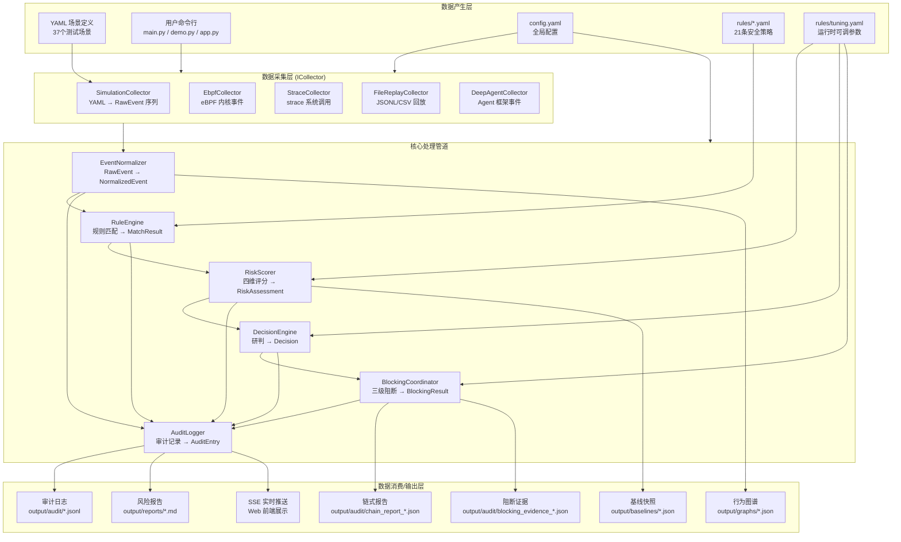
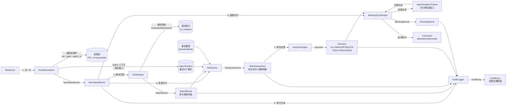

# 数据流图

> 描述系统中从数据产生到数据消费的完整流转路径。
> 文档日期：2026 年 7 月 30 日

---

## 一、顶层数据流总览



---

## 二、数据采集流（6 种模式）

### 2.1 模拟模式（SimulationCollector）

```
YAML 场景文件                          RawEvent 序列
┌──────────────────┐                  ┌──────────────┐
│ scenario_id: n01 │                  │ event_id     │
│ events:          │  ── 解析 ──▶    │ event_type   │
│   - type: exec   │                  │ agent_id     │
│     delay_ms: 500│                  │ timestamp_ns │  ──▶ EventNormalizer
│     executable:..│                  │ executable   │
│   - type: file...│                  │ file_path    │
└──────────────────┘                  │ remote_addr  │
                                      └──────────────┘
```

**数据来源**：`scenarios/{normal,anomalous,boundary,multi_agent,extreme}/` 下的 37 个 YAML 文件
**时间源**：VirtualClock（按 `delay_ms` 推进）
**通信方式**：Python Generator `yield`，不经过管道

### 2.2 eBPF 模式（EbpfCollector）

```
Linux 内核                         eBPF 程序                    Python 引擎
┌──────────────┐     perf buffer    ┌────────────────┐         ┌──────────────┐
│ tracepoint   │ ────────────────▶ │ observer.bpf.c  │ ──────▶│ EbpfCollector│
│ sys_enter_*  │                   │ 格式化 + 过滤    │  JSON   │ RawEvent     │
│ kprobe       │ ◀──────────────── │ bpf_override_   │◀───────│ block cmd    │
│ sys_call     │   阻断指令         │ return          │         │              │
└──────────────┘                   └────────────────┘         └──────────────┘
```

**eBPF 探针列表（v2.0）**：
| 类型 | 挂载点 | 方向 | 用途 |
|------|--------|:---:|------|
| tracepoint | sys_enter_execve | 观测 | 捕获命令执行 |
| tracepoint | sys_enter_openat | 观测 | 捕获文件打开 |
| tracepoint | sys_enter_connect | 观测 | 捕获网络连接 |
| kprobe | sys_execve | 阻断 | 拦截命令执行 |
| kprobe | sys_openat | 阻断 | 拦截文件打开 |
| kprobe | sys_connect | 阻断 | 拦截网络连接 |

### 2.3 strace 降级模式（StraceCollector）

```
strace 进程                        Python 引擎
┌──────────────────┐              ┌──────────────────┐
│ strace -f -e      │  stdout      │ StraceCollector  │
│ trace=execve,     │ ──────────▶ │ 行解析 → RawEvent │
│ openat,connect,... │  逐行       │                  │
└──────────────────┘              └──────────────────┘
```

**适用场景**：无 root 权限、无法加载 eBPF 时的降级方案

### 2.4 文件回放模式（FileReplayCollector）

```
JSONL/CSV 文件                     Python 引擎
┌──────────────────┐              ┌──────────────────┐
│ event_id,t,type..│              │FileReplayCollector│
│ evt001,100,exec..│ ── 逐行 ──▶ │ 解析 → RawEvent   │
│ evt002,200,file..│              │ (支持 time_scale) │
└──────────────────┘              └──────────────────┘
```

**来源**：外部工具导出的 JSONL（如 `test_data/whitebox/malicious_curl.jsonl`）
**功能**：支持时间缩放因子（`time_scale`）、循环回放（`loop`）

### 2.5 DeepAgent 模式（DeepAgentCollector）

```
AI Agent 框架                      Python 引擎
┌──────────────────┐              ┌──────────────────┐
│ DeepAgents 运行时 │  Hook 拦截   │DeepAgentCollector│
│ (LangChain/       │ ──────────▶ │ RawEvent         │
│  CrewAI/etc.)     │              │                  │
└──────────────────┘              └──────────────────┘
```

**集成方式**：通过 `adapter/agent_bridge.py` + `adapter/hook_registry.py` 注册框架钩子

### 2.6 C++ 探针模式（CppProbeCollector）

```
C++ 探针进程                      Python 引擎
┌──────────────────┐     FIFO      ┌──────────────────┐
│ ProcessProbe     │ ────────────▶│ PipeReader        │
│ FileProbe        │  正向管道     │ RawEvent          │
│ NetworkProbe     │ ◀────────────│ CommandSender     │
│                  │  反向管道     │ (allow/block/     │
│                  │               │  terminate)       │
└──────────────────┘              └──────────────────┘
```

**通信数据格式**：JSON 行协议（`RawEvent.to_json_line()` / `Command.to_json_line()`）

---

## 三、核心处理管道数据流



### 3.1 各阶段数据转换详表

| 阶段 | 输入数据类型 | 输出数据类型 | 核心字段变化 |
|------|------------|------------|-------------|
| 归一化 | `RawEvent` | `NormalizedEvent` | +agent_context, +process_node, +command_string |
| 规则匹配 | `NormalizedEvent` | `MatchResult` | +matched_rules, +match_details |
| 多维评分 | `NormalizedEvent` + `MatchResult` + `AgentContext` + `BaselineModel` | `RiskAssessment` | +overall_score, +risk_level, +dimension_scores |
| 研判决策 | `RiskAssessment` | `Decision` | +action, +tier, +reason |
| 阻断执行 | `NormalizedEvent` + `Decision` | `BlockingResult` | +blocked, +cmd_id |
| 审计记录 | 以上全部 | `AuditEntry` | 聚合全链路信息 |

---

## 四、输出数据流

```
                           ┌──────────────────┐
                           │   AuditLogger     │
                           └──────┬───────────┘
                                  │
          ┌───────────────────────┼───────────────────────┐
          │                       │                       │
          ▼                       ▼                       ▼
┌─────────────────┐   ┌─────────────────┐   ┌─────────────────┐
│ output/audit/    │   │ output/reports/  │   │ SSE 实时推送     │
│ audit_*.jsonl    │   │ risk_report_*.md │   │ (Web 前端)       │
│ (逐行 JSON)      │   │ (Markdown)       │   │                  │
└─────────────────┘   └─────────────────┘   └─────────────────┘

          ┌───────────────────────┼───────────────────────┐
          │                       │                       │
          ▼                       ▼                       ▼
┌─────────────────┐   ┌─────────────────┐   ┌─────────────────┐
│ output/graphs/   │   │ output/baselines/│  │ output/audit/    │
│ behavior_*.json  │   │ baseline_*.json  │  │ chain_report_*.json│
│ (行为图谱)        │   │ (基线快照)        │  │ (链式结构化报告)   │
└─────────────────┘   └─────────────────┘   └─────────────────┘
```

### 4.1 审计日志（JSONL）数据流

```
事件处理完成
    │
    ▼
AuditLogger.log_event()
    │
    ├── 聚合: event + assessment + decision + blocking_result
    ├── 构建: AuditEntry (~20 个字段)
    ├── 序列化: JSON 行（一行一条记录）
    └── 写入: output/audit/audit_{scenario_id}_{timestamp}.jsonl
```

### 4.2 风险报告（Markdown）数据流

```
场景运行结束
    │
    ▼
ReportExporter.export_scenario_report()
    │
    ├── 读取: AuditLogger.get_summary() + read_entries()
    ├── 读取: BehaviorGraph.to_dict()
    ├── 聚合: 概览/风险分布/阻断明细/规则命中/Agent摘要/时间线
    └── 输出: output/reports/risk_report_{scenario_id}_{timestamp}.md
```

### 4.3 链式报告（JSON）数据流

```
阻断事件触发 (Decision.action == BLOCK)
    │
    ▼
ChainReportBuilder.build_report()
    │
    ├── 收集: 事件链（从 EventNormalizer 滑动窗口）
    ├── 构建: 因果链 CauseStep[] (Root Cause → ... → Trigger)
    ├── 评估: 影响类型 + 范围 + 置信度
    ├── 建议: 推荐处置 + 备选方案
    ├── 输出: output/audit/chain_report_{report_id}.json
    └── 输出: output/reports/风险分析报告_{report_id}.md
```

---

## 五、配置与规则数据流

```
config.yaml                         RuleEngine
┌──────────────────┐               ┌──────────────────┐
│ mode: "auto"     │──────────────▶│ 采集模式选择       │
│ pipeline: {...}  │               └──────────────────┘
│ scoring: {...}   │──────────────▶ RiskScorer 权重
│ blocking: {...}  │──────────────▶ ViolationTracker 阈值
│ baseline: {...}  │──────────────▶ BaselineChecker 参数
│ output: {...}    │──────────────▶ AuditLogger/ReportExporter 路径
└──────────────────┘

rules/default_policy.yaml           rules/tuning.yaml
┌──────────────────┐               ┌──────────────────┐
│ version: "2.0"   │──────────────▶│ scoring.dimensions│──▶ RiskScorer
│ rules:           │   RuleEngine  │ decision.         │──▶ DecisionEngine
│   - R001..R021   │   21条规则     │   thresholds      │
└──────────────────┘               │ escalation.       │──▶ ViolationTracker
                                   │   thresholds      │
                                   └──────────────────┘
```

---

## 六、Web 模式数据流（SSE 实时推送）

```
场景运行线程                      SSE 推送线程               浏览器
┌──────────────┐    queue.Queue   ┌──────────────┐   SSE    ┌──────────┐
│ ScenarioRunner│ ──────────────▶│ StreamHandler │ ──────▶│ index.html│
│               │  log_entry     │               │text/    │          │
│ 每处理一个事件  │                │ 格式化 SSE     │event-   │ 实时渲染  │
│ → put(log)    │                │ data: {...}\n\n│stream  │          │
└──────────────┘                └──────────────┘        └──────────┘
```

**SSE 事件类型**：
- `log`: 单个事件的审计日志（AuditEntry）
- `stats`: 统计更新（已处理/放行/告警/阻断计数）
- `done`: 场景运行完成
- `error`: 运行错误

---

## 七、阻断指令反向数据流

```
BlockingCoordinator              CommandSender              采集层
┌──────────────────┐            ┌──────────────┐          ┌──────────────┐
│ Decision          │            │ MockSender    │  allow   │ Simulation   │
│ (Tier2/Tier3)    │───────────▶│ (模拟模式)     │────────▶│ (忽略)        │
│                   │            │               │          │              │
│                   │            │ FifoSender    │  FIFO    │ C++ 探针     │
│                   │            │ (守护进程)     │────────▶│ CommandReader │
│                   │            │               │          │              │
│                   │            │ EbpfSender    │  eBPF map│ eBPF 程序    │
│                   │            │ (eBPF 模式)   │────────▶│ kprobe 阻断   │
└──────────────────┘            └──────────────┘          └──────────────┘

指令格式 (Command):
┌────────────┬──────────────────────────────────────┐
│ cmd_id     │ "CMD-XXXXXX"                        │
│ cmd_type   │ allow / block_event / terminate     │
│ target_*   │ event_id / pid                      │
│ action     │ return_eperm / kill_process          │
│ reason     │ 决策原因说明                          │
│ timestamp  │ 虚拟/真实时钟纳秒                      │
└────────────┴──────────────────────────────────────┘
```
