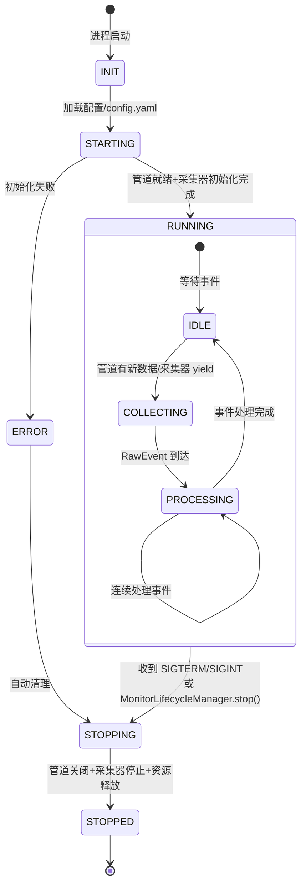
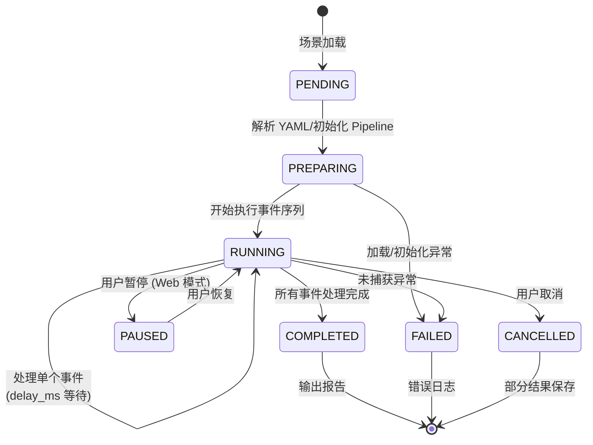
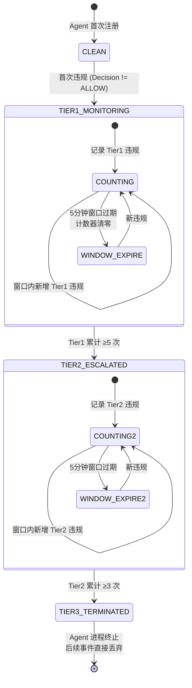
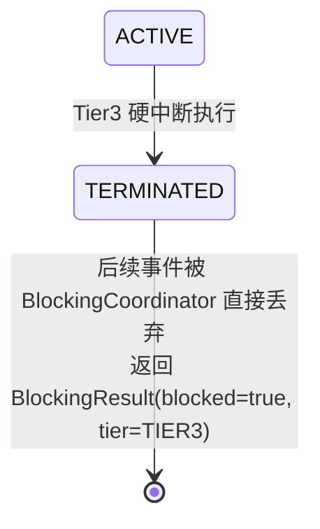
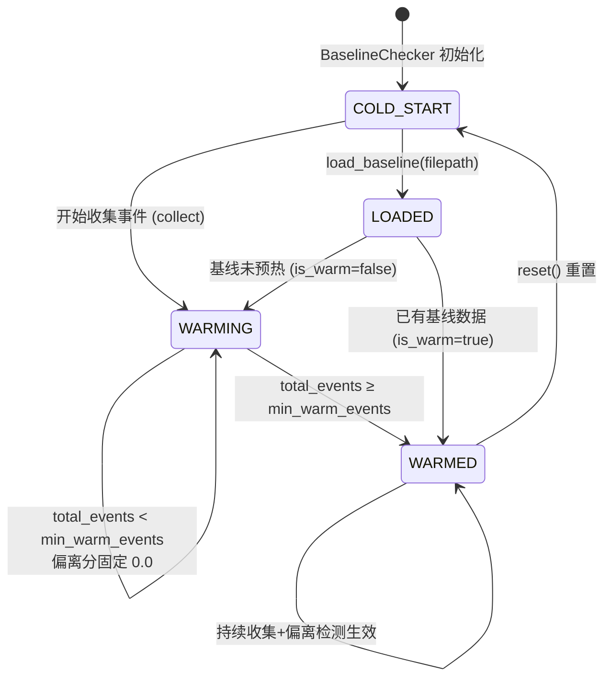
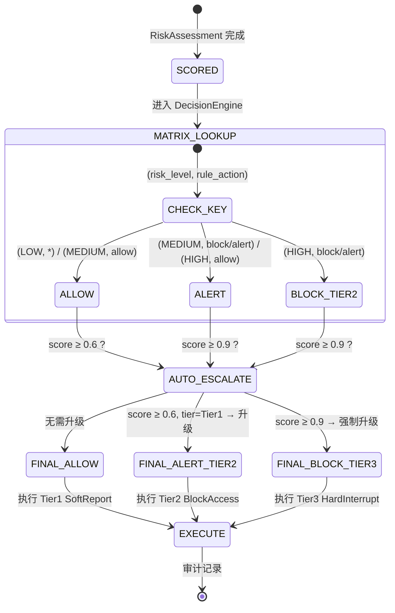
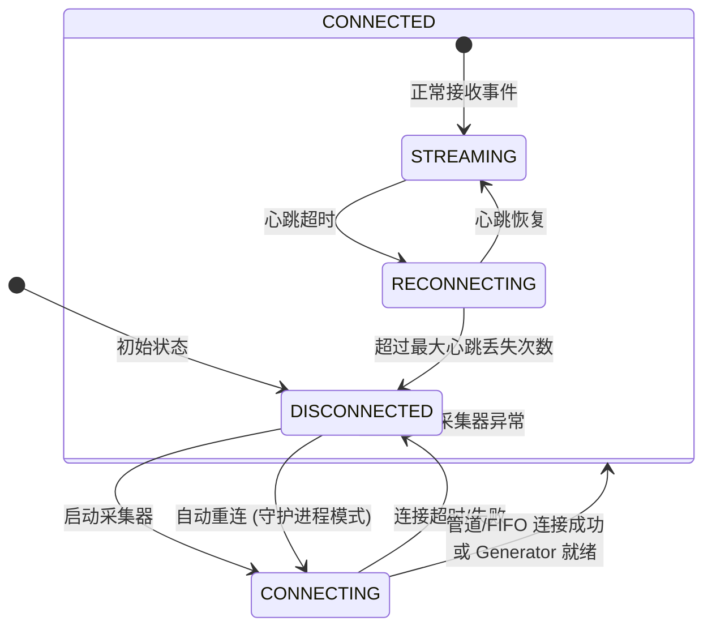
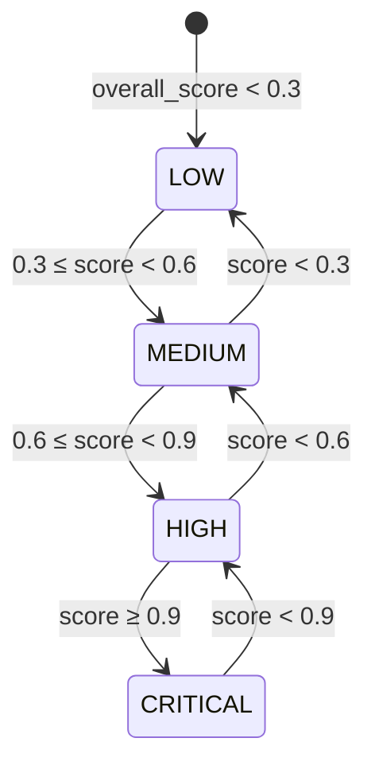

# 状态机图

> 描述系统核心实体的状态转换。所有状态机以当前实际代码为基准。
> 文档日期：2026 年 7 月 30 日

---

## 一、Monitor 守护进程生命周期状态机

**状态说明**：

| 状态 | 描述 | 触发条件 | 执行动作 |
|------|------|---------|---------|
| INIT | 进程启动，尚未加载配置 | 进程入口 | 解析命令行参数 |
| STARTING | 加载配置，初始化各子系统 | `MonitorLifecycleManager.start()` | 加载 config.yaml → 创建管道 → 初始化采集器 → 启动核心 Pipeline |
| RUNNING | 正常运行，处理事件 | 初始化成功 | 进入事件循环（IDLE/COLLECTING/PROCESSING） |
| ERROR | 初始化失败 | 管道创建失败、采集器初始化失败 | 记录错误日志，尝试降级 |
| STOPPING | 正在关闭 | 信号或 `stop()` 调用 | 发送停止信号 → 等待事件处理完成 → 清理资源 |
| STOPPED | 已完全停止 | 清理完成 | 进程退出 |

---

## 二、场景运行状态机

**状态说明**：

| 状态 | 触发 | 产物 |
|------|------|------|
| PENDING | 用户选择场景 | — |
| PREPARING | 点击运行 | Normalized Pipeline 实例化、BaselineChecker 初始化 |
| RUNNING | Pipeline 就绪 | 逐事件：归一化→规则匹配→评分→研判→阻断→审计 |
| PAUSED | 用户暂停 | 保留当前进度和状态 |
| COMPLETED | 事件序列耗尽 | 审计日志、风险报告、基线快照、行为图谱 |
| FAILED | 异常 | 错误日志、部分审计记录 |
| CANCELLED | 用户取消 | 部分结果保存 |

---

## 三、Agent 违规升级状态机

**核心参数**（从 `AgentViolationTracker` + `tuning.yaml`）：

| 参数 | 默认值 | 说明 |
|------|:---:|------|
| WINDOW_SIZE_NS | 300,000,000,000 (5分钟) | 虚拟时钟滑动窗口 |
| TIER1_ESCALATE_THRESHOLD | 5 | Tier1 累计次数 → 升级 Tier2 |
| TIER2_ESCALATE_THRESHOLD | 3 | Tier2 累计次数 → 升级 Tier3 |

**Agent 终止后行为**：

---

## 四、基线模型冷热状态机

**冷启动行为**：
- `BaselineChecker.is_cold_start == True` 时
- `BaselineChecker.compute_deviation()` → 固定返回 `0.0`
- `BasicBaselineScore.score()` 检查 `baseline.get("is_warm")` → 冷启动返回 `0.0`
- `BasicSequenceScore.score()` 检查 `context.event_count < min_events` → 冷启动返回 `0.0`

---

## 五、事件处理决策状态机（研判矩阵 + 自动升级）

**研判矩阵**（3×3）：

| 风险等级 \ 规则动作 | 命中 block | 命中 alert | 未命中 (allow) |
|:---:|:---:|:---:|:---:|
| **HIGH** | BLOCK @ TIER2 | BLOCK @ TIER2 | ALERT @ TIER1 |
| **MEDIUM** | ALERT @ TIER1 | ALERT @ TIER1 | ALLOW @ TIER1 |
| **LOW** | ALLOW @ TIER1 | ALLOW @ TIER1 | ALLOW @ TIER1 |

**自动升级覆盖**：

| 条件 | 覆盖结果 |
|------|---------|
| `overall_score ≥ 0.9` | 强制 BLOCK @ TIER3（忽略矩阵结果） |
| `overall_score ≥ 0.6` 且当前 TIER1 | 升级到 ALERT @ TIER2 |

---

## 六、采集器连接状态机

**心跳机制**（Command.HEARTBEAT）：

| 参数 | 值 | 说明 |
|------|:---:|------|
| heartbeat_interval_ms | 1000 | 心跳发送间隔 |
| heartbeat_max_miss | 3 | 最大未响应次数（超过则断开） |

---

## 七、全局风险等级状态机

**评分阈值**（从 `config.yaml` + `RiskAssessment.score_to_level()`）：

| 评分范围 | 风险等级 | 典型触发场景 |
|---------|:---:|------|
| [0.0, 0.3) | LOW | 正常开发操作、合法命令 |
| [0.3, 0.6) | MEDIUM | 边界操作、非标准端口、Unknown package install |
| [0.6, 0.9) | HIGH | 危险命令、敏感文件访问、sudo 提权 |
| [0.9, 1.0] | CRITICAL | 反弹 Shell、rm -rf /、已知恶意 IP |
