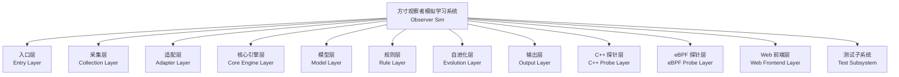
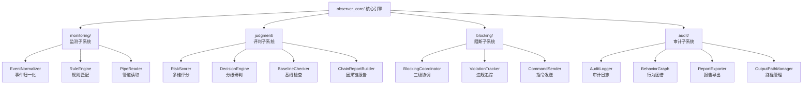
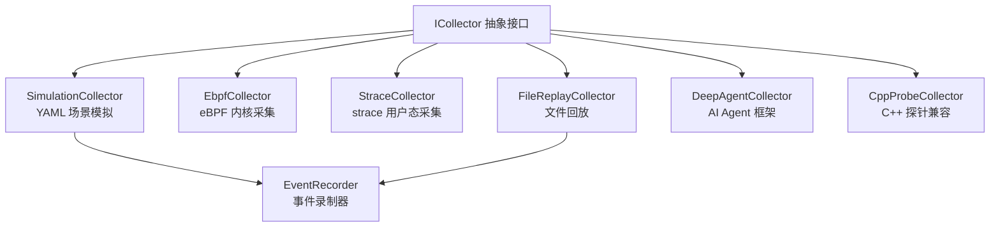
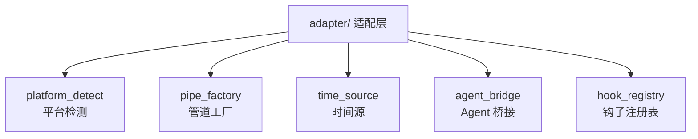
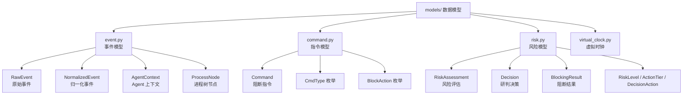
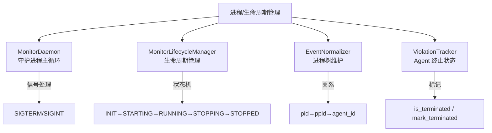
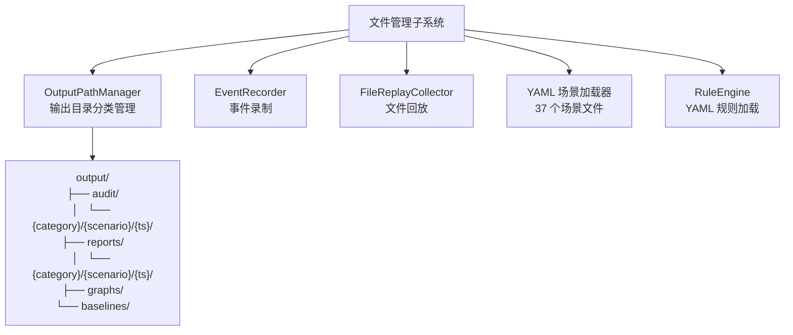
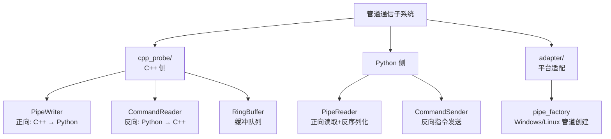
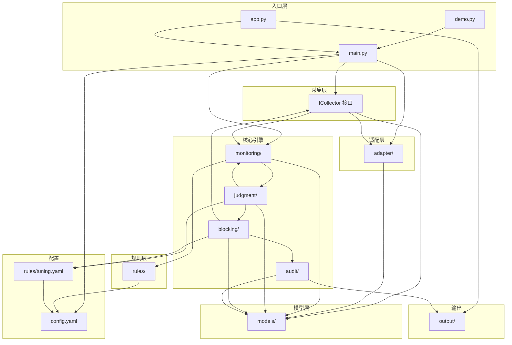

# 模块设计图

> 以功能层次视角描述项目的一、二、三级模块划分及其相互关系。
> 覆盖主要业务功能模块及关键子系统。
> 文档日期：2026 年 7 月 30 日

---

## 一、模块总览（一级模块）



**一级模块职责表**：

| 模块 | 目录/文件 | 职责 | 代码量 |
|------|----------|------|:---:|
| 入口层 | `main.py`, `demo.py`, `app.py` | 用户交互入口，模式选择与启动 | ~4500 行 |
| 采集层 | `collector/` | 多采集模式统一抽象（ICollector 接口） | ~2000 行 |
| 适配层 | `adapter/` | 平台适配（管道、时间、Agent 框架） | ~1200 行 |
| 核心引擎层 | `observer_core/` | 事件处理 Pipeline（监测→研判→阻断→审计） | ~4000 行 |
| 模型层 | `models/` | 核心数据结构定义 | ~550 行 |
| 规则层 | `rules/` | 安全策略规则与可调参数 | ~600 行 |
| 自进化层 | `evolution/` | 自优化接口预留（桩） | ~200 行 |
| 输出层 | `output/` | 审计日志、报告、图谱、基线输出目录 | 运行时生成 |
| C++ 探针层 | `cpp_probe/` | 系统级事件采集探针（兼容模式） | ~1500 行 |
| eBPF 探针层 | `ebpf/` | Linux 内核探针（观测+阻断） | ~200 行 |
| Web 前端层 | `static/`, `analysis_panels.py` | 浏览器可视化界面 | ~3000 行 |
| 测试子系统 | `tests/`, `scenarios/` | 单元测试 + 场景定义 | ~4000 行 |

---

## 二、核心引擎层（二级模块展开）



### 2.1 监测子系统（monitoring/）

| 三级模块 | 文件 | 功能 | 接口 |
|---------|------|------|------|
| EventNormalizer | `event_normalizer.py` | 进程树维护、Agent 上下文、事件归一化 | `IEventNormalizer`: `normalize()`, `get_agent_context()` |
| RuleEngine | `rule_engine.py` | YAML 规则加载、4 种模式匹配 | `IRuleEngine`: `load_rules()`, `match()`, `add_rule()` |
| PipeReader | `pipe_reader.py` | C++ 管道 JSON 行读取与 RawEvent 反序列化 | 内部模块 |

**数据流**：`PipeReader → RawEvent → EventNormalizer → NormalizedEvent → RuleEngine → MatchResult`

### 2.2 评判子系统（judgment/）

| 三级模块 | 文件 | 功能 | 接口 |
|---------|------|------|------|
| RiskScorer | `risk_scorer.py` | 四维加权评分、维度注册/替换 | `register_dimension()`, `assess()` |
| DecisionEngine | `decision_engine.py` | 3×3 研判矩阵、评分自动升级 | `decide()` |
| BaselineChecker | `baseline_checker.py` | 基线构建、偏离计算、冷启动处理、快照保存/加载 | `collect()`, `compute_deviation()`, `save_baseline()`, `load_baseline()` |
| ChainReportBuilder | `chain_report_builder.py` | 因果链构建、JSON+Markdown 双输出 | `build_report()`, `save_json()`, `save_markdown()` |

**四维评分维度**：

| 维度 | 实现类 | 权重 | 说明 |
|------|------|:---:|------|
| D1 规则命中分 | `BasicRuleScore` | 40% | 基于命中规则优先级与数量 |
| D2 基线偏离分 | `BasicBaselineScore` | 25% | 冷启动期固定 0.0；预热后检查命令/路径/网络/时间偏离 |
| D3 上下文风险分 | `BasicContextScore` | 20% | 滑动窗口内可疑序列检测 |
| D4 序列异常分 | `BasicSequenceScore` | 15% | 事件类型频率异常（冷启动期 0.0） |

### 2.3 阻断子系统（blocking/）

| 三级模块 | 文件 | 功能 | 接口 |
|---------|------|------|------|
| BlockingCoordinator | `blocking_coordinator.py` | 三级路由分发、违规升级集成 | `execute()`, `get_statistics()`, `save_evidence()` |
| AgentViolationTracker | `violation_tracker.py` | 虚拟时钟滑动窗口违规计数与升级 | `record_violation()`, `is_terminated()`, `mark_terminated()` |
| CommandSender | `command_sender.py` | 反向管道指令发送（Mock/FIFO/eBPF 三种实现） | `ICommandSender`: `send_command()`, `next_cmd_id()` |

**三级阻断处理器**：

| 等级 | 处理器 | 对 Agent 影响 | 反向指令 |
|:---:|------|------------|---------|
| Tier1 | `SoftReportHandler` | 无 — 操作正常执行 | `Command.make_allow()` |
| Tier2 | `BlockAccessHandler` | 操作被阻止 — 模拟 EPERM | `Command.make_block()` |
| Tier3 | `HardInterruptHandler` | 进程树终止 — SIGTERM→SIGKILL | `Command.make_terminate()` |

### 2.4 审计子系统（audit/）

| 三级模块 | 文件 | 功能 |
|---------|------|------|
| AuditLogger | `audit_logger.py` | JSONL 审计日志（逐行写入），支持按场景分文件 |
| BehaviorGraph | `behavior_graph.py` | 行为图谱构建（节点/边/Agent 摘要） |
| ReportExporter | `report_exporter.py` | Markdown 风险报告 + 片段拼接报告 + 全场景汇总 |
| OutputPathManager | `output_path_manager.py` | 输出目录分类管理（按分类→场景→时间戳组织） |

---

## 三、采集层（二级模块展开）



**ICollector 接口方法**：

| 方法 | 返回值 | 说明 |
|------|------|------|
| `start()` | None | 启动采集 |
| `stop()` | None | 停止采集 |
| `events()` | Iterator[RawEvent] | 事件生成器（yield） |
| `send_command(cmd: Command)` | None | 发送阻断指令 |
| `is_connected` | bool | 连接状态 |

**6 种采集模式对比**：

| 采集器 | 时间源 | 通信方式 | 阻断支持 | 权限要求 |
|--------|:---:|------|:---:|:---:|
| SimulationCollector | VirtualClock | Generator yield | Mock | 无 |
| EbpfCollector | RealtimeClock | perf buffer + eBPF map | ✅ kprobe 真实阻断 | root |
| StraceCollector | RealtimeClock | subprocess stdout | ❌ 观测模式 | 无 |
| FileReplayCollector | VirtualClock (可缩放) | 文件读取 | Mock | 无 |
| DeepAgentCollector | RealtimeClock | AgentBridge hook | Mock | 无 |
| CppProbeCollector | RealtimeClock | FIFO 双向管道 | Mock/FIFO | 无 |

---

## 四、适配层（二级模块展开）



| 模块 | 功能 | 关键能力 |
|------|------|---------|
| platform_detect | 检测运行平台（Windows/Linux/macOS） | `is_windows()`, `is_linux()`, `get_platform_name()` |
| pipe_factory | 按平台创建管道适配器 | `WindowsNamedPipeAdapter`, `LinuxFifoAdapter` |
| time_source | 按采集模式选择时间源 | `VirtualClock`（模拟/回放）, `RealtimeClock`（eBPF/strace） |
| agent_bridge | 与 AI Agent 框架通信 | 连接 DeepAgents/LangChain/CrewAI 运行时 |
| hook_registry | 注册 Agent 框架行为钩子 | 拦截 Agent 的工具调用/文件操作/网络请求 |

---

## 五、模型层（二级模块展开）



---

## 六、关键子系统识别

### 6.1 测试子系统

```
tests/                              scenarios/
├── test_monitoring.py              ├── normal/        (N01-N08)
├── test_judgment.py                ├── anomalous/     (A01-A12)
├── test_blocking.py                ├── boundary/      (B01-B08)
├── test_audit.py                   ├── multi_agent/   (M01-M05)
├── test_integration.py             └── extreme/       (E01-E04)
├── test_pipe_communication.py
├── test_virtual_clock.py
└── conftest.py (pytest fixtures)
```

**职责**：
- 单元测试：每个 `observer_core/` 子模块独立验证
- 集成测试：完整 Pipeline 端到端验证
- 管道通信测试：C++ ↔ Python 双向通信
- 场景测试：37 个 YAML 场景覆盖正常/异常/边界/多 Agent/极端五大类

**测试规模**：367 个测试用例，全部通过

### 6.2 进程/生命周期管理子系统



**核心能力**：
- 守护进程模式：`monitor_daemon.py`（692 行）长期运行，后台监听
- 生命周期管理：`monitor_lifecycle.py`（697 行）统一管理采集器启停、管道创建/销毁
- 进程树追踪：`EventNormalizer` 维护 pid→ppid→agent_id 关联，子进程自动继承 Agent 身份
- 进程终止：Tier3 时 `ViolationTracker.mark_terminated()` 标记，后续事件直接丢弃

### 6.3 文件管理子系统



**核心能力**：
- 分类归档：按 `{category}/{scenario_id}/{timestamp}/` 三级目录组织
- 录制与回放闭环：`EventRecorder` 记录 → JSONL 文件 → `FileReplayCollector` 回放
- 场景加载：统一加载 `scenarios/` 下 37 个 YAML 场景文件
- 规则加载：`RuleEngine.load_rules()` 解析 YAML 规则文件

### 6.4 管道通信子系统



**通信协议**：
- **数据格式**：JSON 行协议（每行一个完整的 JSON 对象）
- **正向管道**（C++ → Python）：`RawEvent.to_json_line()` + `\n`
- **反向管道**（Python → C++）：`Command.to_json_line()` + `\n`
- **连接管理**：心跳探测（`Command.make_heartbeat()`），超时断开，自动重连

**平台差异**：

| 平台 | 管道类型 | 路径格式 | 适配器 |
|------|---------|---------|------|
| Windows | Named Pipe | `\\.\pipe\observer_events` | WindowsNamedPipeAdapter |
| Linux | FIFO | `/tmp/observer/events` | LinuxFifoAdapter |

---

## 七、模块依赖关系图



**依赖方向约束**：
- 所有模块依赖 `models/`（核心数据结构），`models/` 不依赖任何其他模块
- `monitoring/` → `judgment/` → `blocking/` → `audit/` 形成单向管道流
- `blocking/` 通过 ICollector 接口向采集层发送阻断指令（反向流）
- `adapter/` 被采集层和入口层共同依赖，提供平台抽象
- 配置层（config.yaml / tuning.yaml）被所有模块读取，但不产生代码依赖

---

## 八、模块与关键子系统映射

| 关键子系统 | 涉及模块 | 说明 |
|-----------|---------|------|
| **测试子系统** | `tests/` + `scenarios/` + `conftest.py` | 单元测试、集成测试、场景定义 |
| **进程/生命周期管理** | `monitor_daemon.py` + `monitor_lifecycle.py` + `EventNormalizer` + `ViolationTracker` | 守护进程 + 进程树 + Agent 终止 |
| **文件管理** | `OutputPathManager` + `EventRecorder` + `FileReplayCollector` + `RuleEngine` | 输出归档、录制回放、场景/规则加载 |
| **管道通信** | `cpp_probe/` + `PipeReader` + `CommandSender` + `pipe_factory` | 双向 JSON 行管道 + 平台适配 |
| **Web 实时推送** | `app.py` + `static/index.html` + `analysis_panels.py` | SSE 实时事件流 + 浏览器渲染 |
| **自进化闭环** | `evolution/interfaces.py` (ITraceStore/IPatternMiner/IStrategyGenerator) | 接口预留，待实现 |
| **评分系统** | `RiskScorer` + 4 个 IRiskDimension 实现 + `tuning.yaml` | 可替换维度、可调权重 |
| **阻断系统** | `BlockingCoordinator` + 3 级处理器 + `ViolationTracker` + `CommandSender` | 三级梯度阻断 + 违规升级 |
